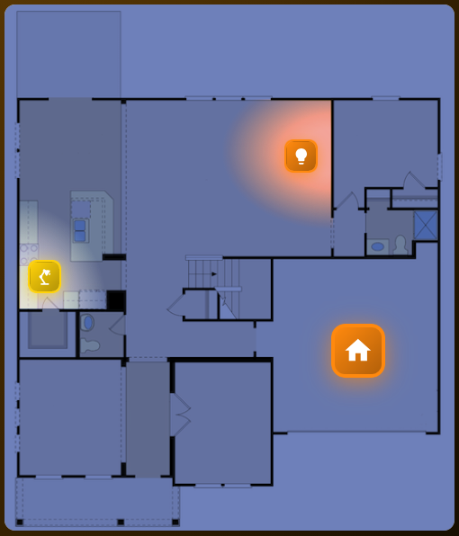

# HA-Floorplan-with-Lights
My Custom Picture-Elements Card with CSS based lights that can be adopted to any layout.

I used the included Picture-Elements card and [Card-Mod](https://github.com/thomasloven/lovelace-card-mod)


## Feature Showcase
Individual areas and icons light up

<video src="https://github.com/user-attachments/assets/7c95b974-b189-4f15-a868-d1d5faeb4d9f" width="600" />


Light colors show up on the icon and the area around it

<video src="https://github.com/user-attachments/assets/5f1faae3-70f9-4232-9215-d015a3ee02cd" width="600" />


Changing the brightness will make the light area bigger and smaller respectively

<video src="https://github.com/user-attachments/assets/b159bc04-9420-400a-a609-4c6e73a189f5" width="600" />

## Code

#### When copying this card, don't forget to change `light.YOUR_LIGHT_ENTITY` to function properly.
<details>
<summary>Minimal Setup for you to test</summary>


```yaml
type: picture-elements
image: https://demo.home-assistant.io/stub_config/floorplan.png
elements:
  - type: conditional
    conditions:
      - condition: state
        entity: sun.sun
        state: below_horizon
    title: Night
    elements:
      - type: icon
        style:
          transform: none
          left: 0%
          top: 0%
          width: 100%
          height: 100%
          background-color: "#37405d"
          mix-blend-mode: hard-light
        icon: none
        title: Night Background
      - type: conditional
        elements:
          - type: icon
            style:
              transform: none
              color: transparent
              opacity: 70%
              left: 3%
              top: 37.8%
              height: 20%
              width: 20%
              background-image: |
                radial-gradient(at 0% 100% ,rgba(255, 255, 255, 1) 0%, rgba(255, 255, 255, 1) 30%, rgba(0, 0, 0, 0) 70%)
              mix-blend-mode: overlay
            icon: mdi:account
            title: White
            hold_action:
              action: none
            tap_action:
              action: none
          - type: icon
            style:
              transform: none
              color: transparent
              opacity: 80%
              left: 3%
              top: 37.8%
              height: 20%
              width: 20%
              background-image: |
                radial-gradient(at 0% 100%, rgb(242, 228, 194) 0%, rgb(228, 178, 76) var(--brightness), rgba(0, 0, 0, 0) 70%)
              mix-blend-mode: overlay
            icon: mdi:account
            title: Warm
            tap_action:
              action: none
            hold_action:
              action: none
            entity: light.YOUR_LIGHT_ENTITY_NO_RGB
            card_mod:
              style: |
                :host { --brightness: {{ ((state_attr(config.entity,'brightness') or 0) | float / 255 * 50) | round(0) }}%;}
        conditions:
          - condition: state
            entity: light.YOUR_LIGHT_ENTITY_NO_RGB
            state: "on"
        title: No-RGB-Light
      - type: conditional
        elements:
          - type: icon
            style:
              transform: none
              color: transparent
              opacity: 40%
              left: 48%
              top: 18%
              height: 25%
              width: 25%
              background-image: |
                radial-gradient(at 100% 40% ,rgba(255, 255, 255, 1) 0%, rgba(255, 255, 255, 1) 20%, rgba(0, 0, 0, 0) 65%)
              mix-blend-mode: overlay
            icon: mdi:account
            title: White
            hold_action:
              action: none
            tap_action:
              action: none
          - type: icon
            style:
              transform: none
              color: transparent
              opacity: 90%
              left: 48%
              top: 18%
              height: 25%
              width: 25%
              background-image: |
                radial-gradient(at 100% 40%, var(--lightcolor2) var(--brightness), rgba(0, 0, 0, 0) 70%)
              mix-blend-mode: overlay
            icon: mdi:account
            title: Warm
            tap_action:
              action: none
            hold_action:
              action: none
            entity: light.YOUR_LIGHT_ENTITY_RGB
            card_mod:
              style: |
                :host {
                --lightcolor2: rgb({{ (state_attr(config.entity,'rgb_color') or [120,120,130]) | join(', ') }});
                --brightness: {{ ((state_attr(config.entity, 'brightness') or 0) | float / 255 * 50) | round(0) }}%;
                }
        conditions:
          - condition: state
            entity: light.YOUR_LIGHT_ENTITY_RGB
            state: "on"
        title: RGB-Light
  - type: state-icon
    style:
      top: 67%
      left: 80%
      scale: 1.3
    entity: light.YOUR_LIGHT_ENTITY_GROUP
    tap_action:
      action: toggle
    state_color: false
    icon: mdi:home
    card_mod:
      style: |
        :host { --lightcolor1: {{ (state_attr(config.entity, 'rgb_color') or [120,120,130]) | join(', ') }};}
  - type: state-icon
    style:
      top: 51%
      left: 8%
    entity: light.YOUR_LIGHT_ENTITY_NO_RGB
    tap_action:
      action: toggle
    state_color: false
    icon: ""
    card_mod:
      style: |
        :host {
        --lightcolor1: {{ '255,210,10' if states(config.entity) == 'on' else '120,120,130' }};}
  - type: state-icon
    style:
      top: 28%
      left: 65%
    entity: light.YOUR_LIGHT_ENTITY_RGB
    tap_action:
      action: toggle
    state_color: false
    icon: ""
    card_mod:
      style: |
        :host {
        --lightcolor1: {{ (state_attr(config.entity, 'rgb_color') or [120,120,130]) | join(', ') }};}
card_mod:
  style:
    hui-state-icon-element$:
      state-badge$: |
        ha-state-icon
          {
          color: white;
          filter: none !important;
          scale: 111%;
          }
    .: |
      hui-state-icon-element {
      box-shadow: 0 4px 20px rgba(var(--lightcolor1),0.7);
      border: rgba(var(--lightcolor1),1) solid;
      background: linear-gradient(135deg, transparent,rgba(0,0,0,0.3)),
      rgba(var(--lightcolor1),1);
      border-radius: 12px;
      scale: 80%; }
```
</details>

---
